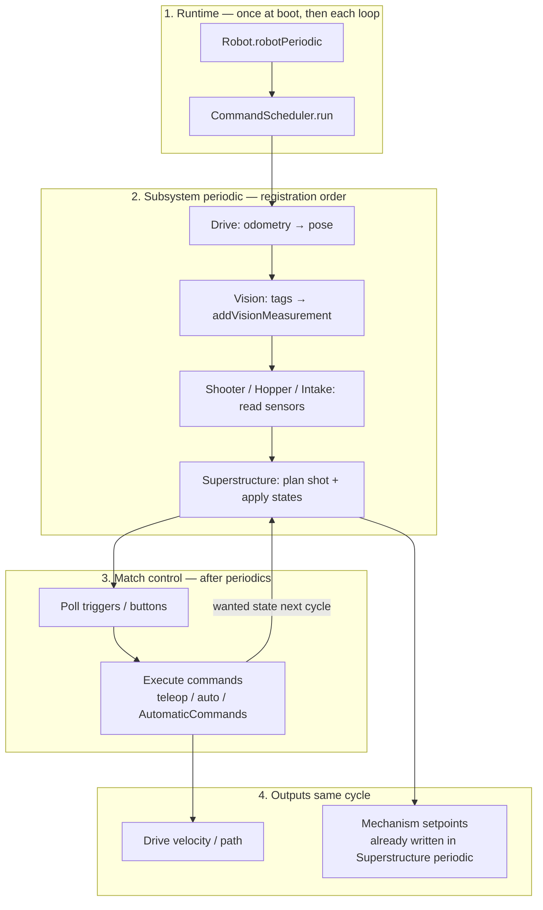
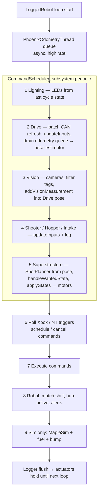
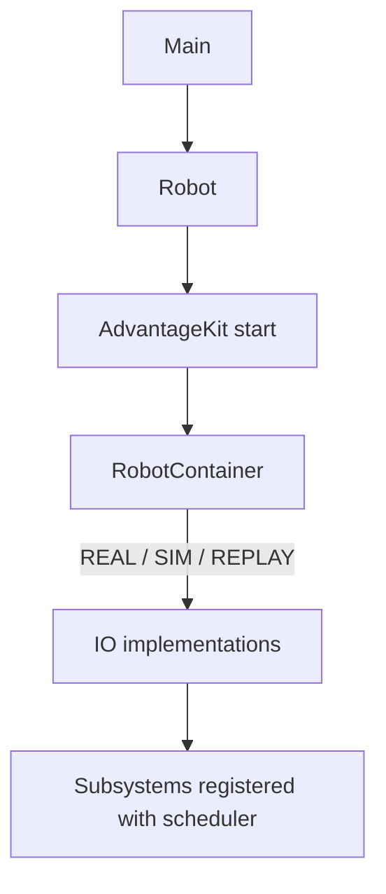
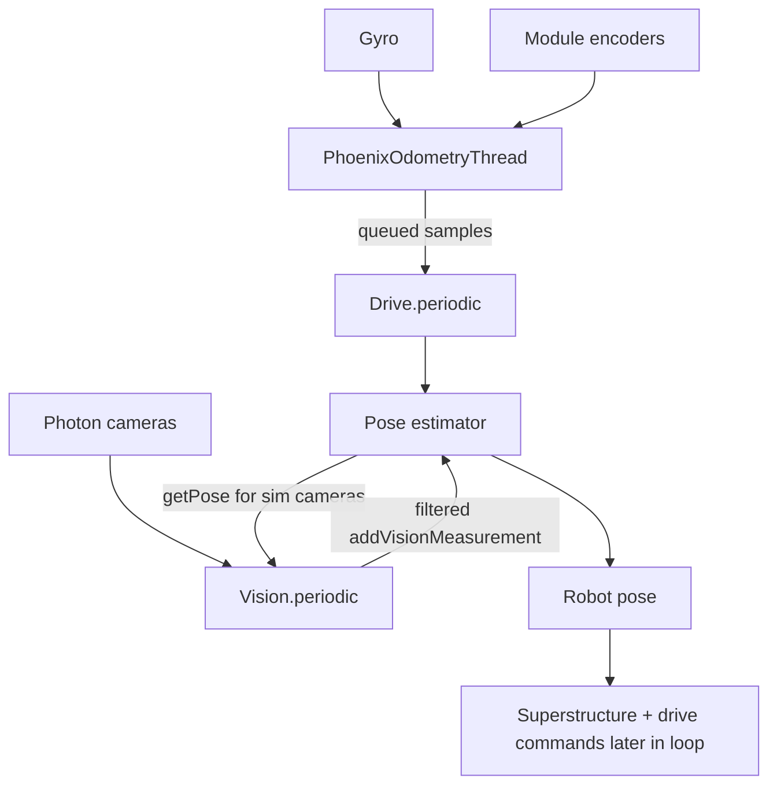
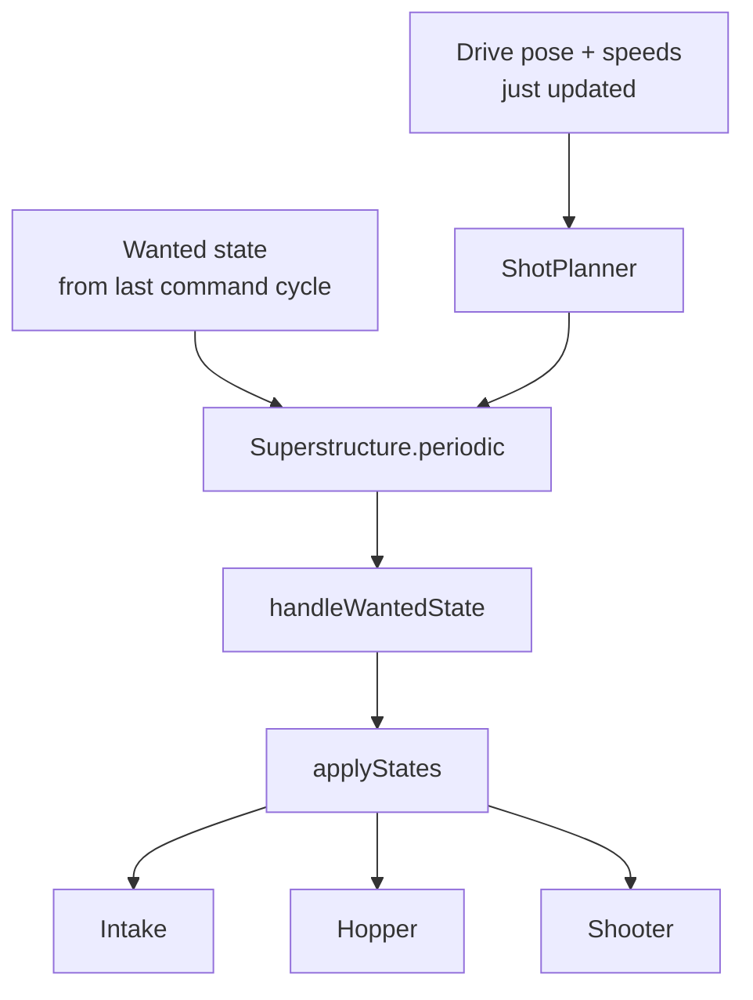
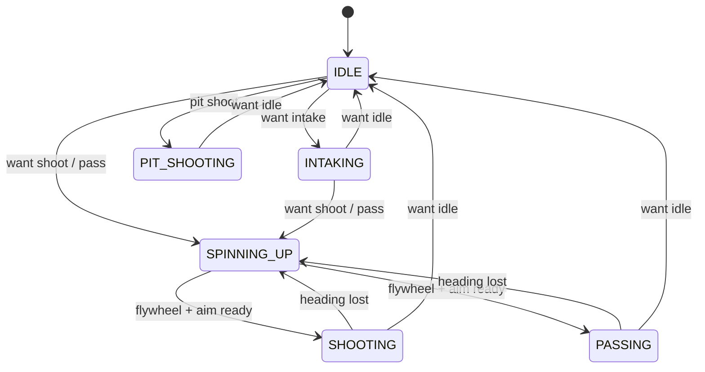
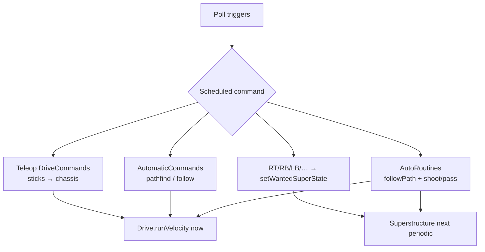
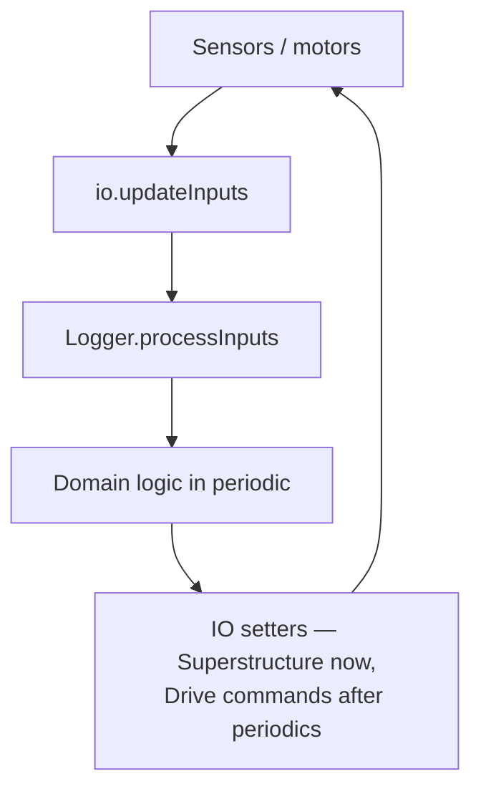

# 2026 Robot Architecture

Team 6238 — FRC 2026 (Rebuilt). WPILib command-based Java with AdvantageKit logging/replay.

The robot intakes fuel, indexes it, and shoots or passes at the hub. Four groups do the work: **runtime**, **mobility**, **game piece path**, and **match control**. Shared IO/logging sits under all of them.

Data moves **top → bottom each 20 ms loop**. Commands set *intent*; Superstructure and Drive apply it. Wanted-state changes take effect on the **next** Superstructure periodic.

---

## Component groups

| Group | What it is | Main types |
|-------|------------|------------|
| **Runtime** | Boot, wiring, mode, identity | `Robot`, `RobotContainer`, `Constants`, `RobotIdentity` |
| **Mobility** | Where the robot is and how it moves | `Drive`, `Vision` |
| **Game piece path** | Intake → hopper → shoot/pass | `Superstructure`, `ShotPlanner`, `Intake*`, `Hopper`, `Shooter` |
| **Match control** | Driver + auto intent | `DriveCommands`, `AutomaticCommands`, `AutoRoutines` |



---

## What `periodic()` is

`periodic()` is a **callback**, not its own thread. Once per control cycle (~20 ms, `Constants.loopPeriodSecs`), WPILib calls `Robot.robotPeriodic()`, which calls `CommandScheduler.run()`. That method walks registered subsystems **one after another on the same thread** and invokes each `periodic()`, then polls buttons and runs command `execute()` — still on that thread.

Drive, Vision, Superstructure, and teleop commands do **not** run in parallel. They take turns in a fixed order every loop. This is a **cyclic executive** (like a PLC scan or Arduino `loop()`), not one OS task per subsystem:

```text
while robot is running:          ← one main thread, ~50 Hz
    Drive.periodic()
    Vision.periodic()
    Shooter/Hopper/Intake.periodic()
    Superstructure.periodic()
    poll Xbox / schedule commands
    command.execute() …          ← joystick, auto, pathfinding
    Robot match logging
    (sim) update physics
    sleep until next 20 ms tick
```

Everyone must finish quickly so the next cycle starts on time. If Superstructure hangs for 30 ms, Drive and commands are late too — there is no preemption between them.

Subsystems share memory on that thread (`drive.getPose()`, `wantedSuperState` are just fields). No locks are needed between them because they never preempt each other.

Background work **does** run on other threads, but it only **feeds data** into the main loop:

| Thread | Role |
|--------|------|
| Main robot thread | All `periodic()`, commands, most control |
| `PhoenixOdometryThread` | High-rate gyro/module samples → queue |
| Motor / CAN / Photon | Device firmware + vendor I/O |
| AdvantageKit logger | Serialize logs off the hot path where possible |

Drive’s `periodic()` drains the odometry queue. Vision’s `periodic()` reads cameras and calls `addVisionMeasurement`. Superstructure then uses that pose. Producers can run concurrently; **decisions and motor setpoints still happen in one serial pass**.

---

## Loop order (every 20 ms)

WPILib runs **all `periodic()` methods first**, then polls bindings, then executes commands. Subsystem order is construction order in `RobotContainer` (Lighting → Drive → Vision → Shooter → Hopper → Intake → Superstructure).

A background **Phoenix odometry thread** (250 Hz CANivore / 100 Hz CAN) samples gyro + modules into a queue the whole time.



| Step | Group | What data moves |
|------|-------|-----------------|
| 1 | Runtime / lighting | Previous Superstructure state → CANdles |
| 2 | Mobility | Sensors → Drive pose (wheels + gyro) |
| 3 | Mobility | Cameras → filtered poses → **same** estimator |
| 4 | Game piece | Mechanism sensors logged; jam flags updated |
| 5 | Game piece | Pose + *current* wanted state → flywheel/feeder/indexer/intake |
| 6–7 | Match control | Sticks/buttons/auto → new wanted state + chassis speeds |
| 8–9 | Runtime | Match metadata; physics step in SIM |

**Lag:** step 7 may change `WantedState` or start a path; Superstructure does not see that until **step 5 next loop**. Chassis `runVelocity` from a drive command applies in step 7 this loop. Shot heading used by angle-lock drive was computed in step 5 this loop (pose already includes this loop's vision).

---

## 1. Runtime

Once: `Main` → `Robot` (`LoggedRobot`) → AdvantageKit receivers → `RobotContainer` (IO + subsystems + bindings + auto chooser).

Each loop: `robotPeriodic` → `CommandScheduler.run()` → shift / hub / battery logging. SIM also runs `updateSimulation()` after that.



| Mode | When | Hardware side |
|------|------|----------------|
| `REAL` | On the roboRIO | TalonFX, Pigeon, PhotonVision |
| `SIM` | Desktop | MapleSim + `*IOSim` |
| `REPLAY` | Log replay | No-op IO; inputs from WPILOG |

`RobotIdentity` chooses COMP vs practice tuner constants from the RIO serial.

---

## 2. Mobility

One pose pipeline. Drive runs **before** Vision in the same loop, then Vision writes corrections into the estimator immediately.



- **Drive** — 4-module Kraken swerve, Phoenix odometry, PathPlanner `AutoBuilder`. Velocity setpoints come from commands **after** periodics.
- **Vision** — `FRONT` + `SIDE`; drop bad tags (ambiguity, Z, out of field); remaining poses update Drive.

---

## 3. Game piece path

Intake, hopper, and shooter are not driven independently during a cycle. **Superstructure** runs last among subsystems: operators/autos already set a *wanted* state on a prior loop; this periodic maps it to *current* state and writes motors. `ShotPlanner` uses the pose just updated by Drive + Vision.





| Piece | Role |
|-------|------|
| Intake (pivot + roller) | Collect; jam reverse on stall |
| Hopper (indexer + top) | Feed shooter; unjam on stall |
| Shooter (flywheel + feeder) | Velocity-controlled eject |
| ShotPlanner | Distance maps + moving-target lead |

Teleop picks shoot vs pass from field X (`Constants.SHOULD_PASS`). `*_INTAKE` wanted states keep collecting while shooting/passing.

---

## 4. Match control

Runs **after** periodics. This group only expresses intent.



| Source | Intent |
|--------|--------|
| Default teleop | Joystick drive (`DriveCommands`) |
| RT / RB | Want shoot or pass + lock heading to this loop's shot setpoint |
| LB / LT / Y / A | Intake, reverse, pivot |
| B / X / D-pad | `AutomaticCommands` pathfind assist |
| Auto chooser | `AutoRoutines`: PathPlanner follow → shoot/pass → intake |

Autos are hand-built sequences around PathPlanner paths (not NamedCommands). Paths live in `src/main/deploy/pathplanner/`.

---

## Shared infrastructure

Every hardware subsystem uses the same AdvantageKit IO split so REAL, SIM, and REPLAY share one control loop. This is **steps 2–5** of each cycle:



Tests mock the IO interface, not the subsystem.

Also in this bucket: CANdle lighting, on-robot test mode, MapleSim arena, `./gradlew replayWatch`.

---

## Related

- [`AGENTS.md`](../AGENTS.md) — commands, IO pattern, tests
- [`README.md`](../README.md) — operator summary
- [`docs/superpowers/`](superpowers/) — feature specs
